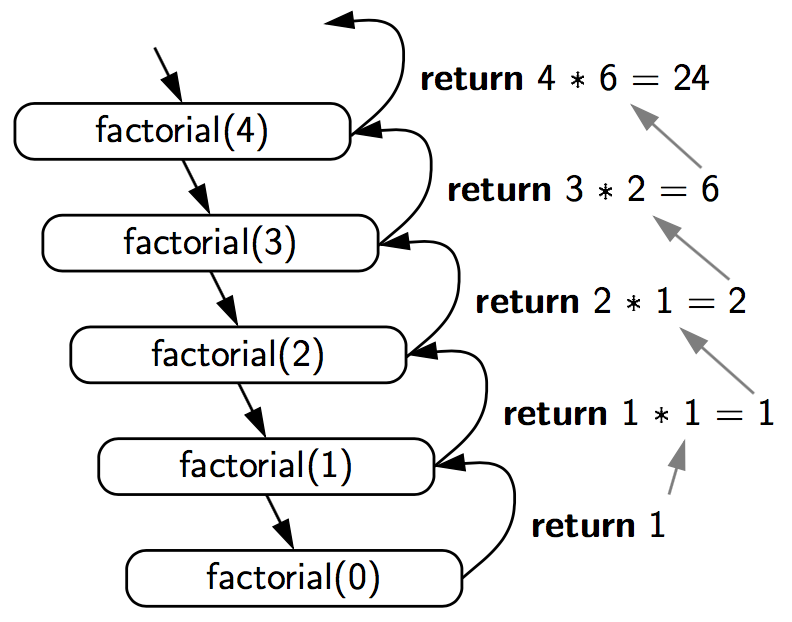

[출처 :https://codepractice.tistory.com/92](https://codepractice.tistory.com/92)

재귀함수한 함수에서 자기 자신(함수) 를 호출하여 작업을 수행하는 방식을 말한다. 되부름, 재귀호출 이라고도 부른다.

## 재귀함수의 특징

- 반드시 종료(탈출)되는 조건을 설정해주어야 한다.
- 같은 행위가 반복될 때 재귀함수를 사용한다.

## 재귀함수의 스택


- Push 와 Pop 으로 이루어진다.
- 가장 나중에 들어온 데이터부터 Pop 이 가능하다.

## 99단

```python
def x99(n):
    if n == 1:
        print("end")
    else:
        num = range(2, 10)
        index = num[n - 2]
        x99(n - 1)
        print(f"{n} 단")
        print([f'{index} * {i} = {index*i}' for i in num])

x99(9)
```

```bash
>> end
>> 2 단
>> ['2 * 2 = 4', '2 * 3 = 6', '2 * 4 = 8', '2 * 5 = 10', '2 * 6 = 12', '2 * 7 = 14', '2 * 8 = 16', '2 * 9 = 18']
>> 3 단
>> ['3 * 2 = 6', '3 * 3 = 9', '3 * 4 = 12', '3 * 5 = 15', '3 * 6 = 18', '3 * 7 = 21', '3 * 8 = 24', '3 * 9 = 27']
>> 4 단
>> ['4 * 2 = 8', '4 * 3 = 12', '4 * 4 = 16', '4 * 5 = 20', '4 * 6 = 24', '4 * 7 = 28', '4 * 8 = 32', '4 * 9 = 36']
>> 5 단
>> ['5 * 2 = 10', '5 * 3 = 15', '5 * 4 = 20', '5 * 5 = 25', '5 * 6 = 30', '5 * 7 = 35', '5 * 8 = 40', '5 * 9 = 45']
>> 6 단
>> ['6 * 2 = 12', '6 * 3 = 18', '6 * 4 = 24', '6 * 5 = 30', '6 * 6 = 36', '6 * 7 = 42', '6 * 8 = 48', '6 * 9 = 54']
>> 7 단
>> ['7 * 2 = 14', '7 * 3 = 21', '7 * 4 = 28', '7 * 5 = 35', '7 * 6 = 42', '7 * 7 = 49', '7 * 8 = 56', '7 * 9 = 63']
>> 8 단
>> ['8 * 2 = 16', '8 * 3 = 24', '8 * 4 = 32', '8 * 5 = 40', '8 * 6 = 48', '8 * 7 = 56', '8 * 8 = 64', '8 * 9 = 72']
>> 9 단
>> ['9 * 2 = 18', '9 * 3 = 27', '9 * 4 = 36', '9 * 5 = 45', '9 * 6 = 54', '9 * 7 = 63', '9 * 8 = 72', '9 * 9 = 81']
```

## Factorial

```python
def factorial(n):
    if n == 0:
        return 1
    return n * factorial(n - 1)

factorial(10)
```

```bash
>> 3628800
```

## 피보나치 수열

```python
def fibonacci(n):
    if n == 0 or n == 1:
        return 1
    return fibonacci(n - 2) + fibonacci(n - 1)

def fibonacci_list(n):
    for i in range(n):
        print(fibonacci(i), end=" ")

fibonacci_list(10)
```

```bash
>> 1 1 2 3 5 8 13 21 34 55
```
